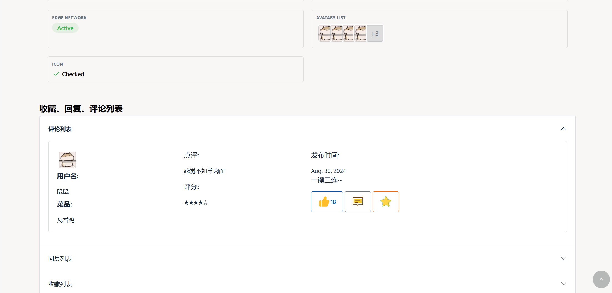

# What-Can-I-Eat? USTC out！(余庆杯 项目报告)

> 参赛队员：
>
> - PB23111612 郑亦航（队长）
>
> - PB23111598 黄佳媛 
>
> - PB23111705 辛昌昊

## 一、项目简介

### 1.1 项目名称

What Can I Eat？USTC Out！——科大美食评估系统

### 1.2 项目背景

随着大学校园食堂提供越来越多的多元化美食，来自不同地区和文化的菜肴让同学们享受到了丰富的饮食选择。然而，面对如此众多的菜品和口味，很多同学在尝试新菜肴时常感到困惑，难以做出最合适的选择。此外，缺乏一个便捷的方式来分享美食体验，也使得大家错失了更多交流与推荐的机会。因此，建立一个美食评估系统显得尤为重要，这个系统可以帮助同学们更好地了解食堂中的各类菜品，提供评价和建议，最终促使大家更加愉悦和自信地探索校园美食。

### 1.3 项目功能

科大美食评估系统 主要分为校内和校外两大部分，旨在为同学们提供一个全面的校园美食分享与评价平台。

- **校内部分**：用户可以在系统中选择具体的校区、食堂及窗口，针对不同的菜品进行点评。每个点评包含菜品名称、拍照展示、详细评价、打星评分等内容，帮助其他同学了解菜品的口味、份量、价格等信息。通过这种方式，同学们能够快速获取关于食堂餐品的真实反馈，做出更符合自己口味的选择。
- **校外部分**：用户可以自由发布对校园周边美食的评价，分享附近餐厅、小吃街、探店经验等内容。每个评价帖子可以附带具体的地理位置、餐厅信息和美食体验，其他用户可以对这些帖子进行点赞、评论、收藏等互动操作，帮助大家发现更多优质的校园外美食。

通过这种形式，What-Can-I-Eat 不仅提供了一个校内食堂评价平台，也为同学们探索校园周边美食提供了丰富的信息和互动空间，增强了校园美食文化的交流与分享。

### 1.4 项目目标

本项目主要目标位开发一个科大美食管理系统的网站，实现对用户信息，美食信息的存储，查找和修改。

经过商议，我们决定选用 B/S 架构，Django框架（python语言），前端使用 Bootraps 模版，后台 DBMS 使用 MySQL

### 1.5 最终实现

我们最终基本完成了网页端的建设，实现了校内相关部分，但并没有对校外部分做相关支持。

我们的下一步计划是实现校外部分，并将离线的数据库接到在线的服务器上，并在登录界面与科大登录系统做适配。

## 二、需求分析

由于涉及用户信息，美食信息的离线存储，搜索和修改，我们认为采用网页端应用，数据库管理的方式是比较合适的。

因此，我们将按照数据库系统设计进行需求分析。

### 2.1 功能需求

#### 2.1.1 校内部分

>参考设计：虎扑评分，评课社区

**用户操作：**

- **发布菜品信息**：用户可以选择校区、食堂、窗口，发布对具体菜品的点评，包含菜品名称、拍照展示、文字评价和打星评分。

- **删除自己的菜品信息**：用户可以删除自己发布的菜品信息。

- **修改自己的菜品信息**：用户可以编辑和更新自己发布的菜品信息。

- **查询菜品信息**：用户可以通过关键词、校区、食堂、窗口等条件查询其他用户发布的菜品信息。

- **点赞**：用户可以对其他用户发布的菜品点评进行点赞。

- **评论**：用户可以对其他用户的菜品点评进行评论，分享个人看法。

- **收藏**：用户可以收藏自己感兴趣的菜品点评，方便后续查看。

- **关注其他用户**：用户可以关注自己喜欢的其他用户，查看他们的最新点评。

**管理员操作：**

- **修改、删除用户发布的评论**：管理员可以对不符合规范的评论进行修改或删除。
- **对校区、餐厅、窗口等实体对象增删改查**：管理员可以对校园内的校区、餐厅、窗口等信息进行增删改查，确保信息的准确性。
- **维护公告**：管理员可以发布公告，告知用户有关食堂运营、菜品更新等信息。
- **审核用户的发布**：管理员可以对用户发布的菜品信息和评论进行审核，确保内容合规。
- **处理用户的举报**：管理员处理用户对不当内容的举报，确保平台的健康运行。

**网页端：**

- **登录页面**：用户可以使用校园账户或社交账户登录系统。
- **注册页面**：新用户可以创建帐户，进行个人信息注册。
- **菜品评论展示页面**：展示用户发布的菜品信息、评价内容、评分以及其他用户的点赞和评论。
- **用户信息展示页面**：展示用户的个人资料、历史发布的点评、收藏的菜品、关注的用户等信息。
- **UI设计**：界面设计简洁、美观，易于操作，支持多设备适配（桌面端、移动端）。

#### 2.1.2 校外部分

>参考设计：微博，小红书

**用户操作：**

- **发布帖子信息**：用户可以发布关于校园周边美食的帖子，内容包括餐厅/小吃的名称、地址、菜品推荐、照片展示和文字评价。
- **删除自己的帖子**：用户可以删除自己发布的帖子。
- **修改自己的帖子**：用户可以修改自己发布的帖子内容。
- **查询帖子**：用户可以通过关键词、地点等条件查询周边美食的帖子。
- **点赞**：用户可以对其他用户发布的帖子进行点赞。
- **评论**：用户可以对其他用户的帖子进行评论，分享自己的看法或体验。
- **收藏**：用户可以收藏自己感兴趣的帖子，方便后续查看。
- **关注其他用户**：用户可以关注自己喜欢的其他用户，查看他们的最新帖子。

**管理员操作：**

- **修改、删除用户发布的帖子或评论**：管理员可以对不符合规范的帖子或评论进行修改或删除。
- **维护公告**：管理员可以发布公告，告知用户有关校外美食信息、活动通知等。
- **审核用户的发布**：管理员审核用户发布的帖子内容，确保其合规。
- **处理用户的举报**：管理员处理用户对不当内容的举报，保障平台内容的健康。

**网页端：**

- **登录页面**：用户可以使用校园账户或社交账户登录系统。
- **注册页面**：新用户可以创建帐户，进行个人信息注册。
- **帖子评论展示页面**：展示用户发布的帖子内容、评论、点赞数、收藏数等。
- **用户信息展示页面**：展示用户的个人资料、历史发布的帖子、收藏的美食帖子、关注的用户等。
- **UI设计**：界面设计简洁、美观，易于操作，支持多设备适配（桌面端、移动端）。

**其余功能**

- 校内和校外部分的功能需求大致相同，主要区别在于校内部分集中在食堂菜品信息和评价，校外部分侧重于周边餐厅和小吃的分享与讨论。
- 所有用户操作都支持基于个人账户的操作，管理员拥有全站内容管理权限，保障平台内容的质量和合规性。

### 2.2 数据需求

以下是根据功能需求所涉及的主要数据项及其结构设计，涵盖了用户、管理员、校区/餐厅/窗口实体、菜品评价、以及帖子等核心模块。

**1.用户数据需求**

用户信息包括用户的基本信息、社交互动记录和发布内容。结构如下：

- **id**：唯一标识符，自动生成，作为用户的主键。
- **昵称**：用户的展示名称。
- **头像**：用户头像，可以为空（如果用户未上传头像）。
- 关注的对象：
  - 关注的**用户**（列表）：用户关注的其他用户列表。
  - 关注的**菜品**（列表）：用户关注的菜品点评。
  - 关注的**帖子**（列表）：用户关注的帖子。
- 收藏列表：
  - 收藏的**帖子**（列表）：用户收藏的帖子。
  - 收藏的**菜品点评**（列表）：用户收藏的菜品评论。
- 点赞列表：
  - 点赞的**帖子**（列表）：用户点赞过的帖子。
  - 点赞的**菜品点评**（列表）：用户点赞过的菜品评论。
- 被关注的对象：
  - 被关注的**用户**（列表）：被其他用户关注的列表。
  - 被关注的**菜品**（列表）：被其他用户关注的菜品点评。
  - 被关注的**帖子**（列表）：被其他用户关注的帖子。
- 发布内容：
  - 发布的**菜品点评**（列表）：用户发布的菜品点评。
  - 发布的**帖子**（列表）：用户发布的周边美食帖子。
- **权限设置**：是否公开用户发布内容，可能的值为：公开、私密。

**2.管理员数据需求**

管理员数据主要包括管理员的基本信息及管理权限。结构如下：

- **id**：管理员唯一标识符。
- **昵称**：管理员的显示名称。
- **头像**：管理员头像，可以为空（如果管理员未上传头像）。
- **权限**：管理员权限信息，控制其能进行的操作（如审核、删除内容、管理公告等）。

 **3. 校区、餐厅、窗口实体数据需求**

这些实体代表了校园内的食堂、餐厅和窗口信息，数据结构如下：

- **名字**：校区、餐厅或窗口的名称。
- **地理位置**：实体的具体位置（例如：某校区某餐厅）。
- **图片**：餐厅或窗口的展示图片。
- **文字简介**：简短的文字介绍，描述餐厅或窗口的特色、菜品等信息。

**4.菜品评价数据需求**

菜品评价信息包含用户对食堂菜品的评论与评分。结构如下：

- **标题**：菜品点评的标题，简短概述点评内容。
- **发布时间**：评价的时间戳。
- **发布者**：发布该点评的用户id。
- **对应窗口**：该菜品点评对应的食堂窗口。
- **图片**：用户上传的菜品图片，可以为空。
- **正文**：菜品点评的详细描述。
- **点赞数**：该点评被点赞的次数。
- **收藏数**：该点评被收藏的次数。
- **其他用户评论**（列表）：其他用户对该点评的评论信息。

**5.帖子数据需求**

帖子代表了用户对校园周边美食的分享与评价。结构如下：

- **标题**：帖子的标题，简短描述帖子内容。
- **发布时间**：帖子发布的时间戳。
- **发布者**：发布该帖子用户的id。
- **地点**：帖子的推荐地点或餐厅名称。
- **图片**：与帖子相关的图片，最多支持多张图片上传。
- **tag**：帖子相关的标签，可以包括餐厅类型、菜系、特色等。
- **正文**：帖子的详细内容，描述餐厅、小吃、食物等。
- **点赞数**：该帖子被点赞的次数。
- **收藏数**：该帖子被收藏的次数。
- **用户评论**（列表）：用户对该帖子发表的评论。

**6.评论数据需求**

评论是用户对菜品点评和帖子进行互动的方式。数据结构如下：

- **评论者**：评论用户的id。
- **评论时间**：评论的时间戳。
- **评论内容**：评论的文本内容。
- **评论对象**：评论是针对菜品点评还是帖子，标明评论对象的id。
- **点赞数**：该评论被点赞的次数。

**7.举报数据需求**

用户可以举报不当内容，管理员需要处理举报。数据结构如下：

- **举报者**：举报用户的id。
- **被举报对象**：被举报的内容（菜品点评、帖子或评论）的id。
- **举报类型**：举报的类型（例如：不当言论、虚假信息、恶意广告等）。
- **举报时间**：举报的时间戳。
- **处理状态**：管理员处理举报后的状态（如：已处理、未处理、正在审核等）。

**8.其他数据需求**

- **公告信息**：管理员发布的平台公告，数据包括：
  - **公告标题**：公告的标题。
  - **公告内容**：公告的详细内容。
  - **发布时间**：公告的发布时间。
- **系统配置**：系统的全局配置和参数设置，如广告内容、首页展示设置等。

这些数据需求基本覆盖了用户、管理员操作和平台功能所需要的数据支持，确保系统能够高效、稳定地运行。

### 2.3 实体设计

>在设计实体时已经考虑实体之间的关系，故不列出关系设计

#### 2.3.1 用户（user）

用户实体代表了系统中的每一个用户，包含用户的基本信息和社交信息

```mysql
create table user
(
    user_id varchar(18) primary key,
    user_name varchar(30) not null,
    introduction varchar(200),
    head_portrait VARCHAR(255)
);
```

**字段说明**：

- **user_id** (`varchar(18)`)：用户的唯一标识符，是表的主键。`user_id` 必须是唯一的，通常是一个系统自动生成的字符串，确保每个用户的身份唯一。
- **user_name** (`varchar(30)`)：用户的用户名，长度限制为 30 个字符。用户名不能为空，用于标识和区分用户。
- **introduction** (`varchar(200)`)：用户的个人介绍，可以为空。长度限制为 200 个字符，用户可以自定义自己的个人简介，描述兴趣爱好、专业背景等。
- **head_portrait** (`varchar(255)`)：用户头像的图片路径，可以为空。存储用户头像图片的 URL 地址或文件路径。

#### 2.3.2 校园（campus）

校区实体用于存储各个校园的基本信息。

```mysql
create table campus
(
    campus_id varchar(18) primary key,      -- 校区唯一标识符，主键
    campus_name varchar(30) not null        -- 校区名称，不能为空
);
```

**字段说明**：

- **campus_id** (`varchar(18)`)：校区的唯一标识符，作为主键。通常是一个唯一的字符串，可以使用 UUID 或其他方式生成。
- **campus_name** (`varchar(30)`)：校区名称，不能为空，用于标识校园的名称。

#### 2.3.3 食堂（canteen）

食堂实体用于存储校园内食堂的基本信息，并与校区进行关联。

```mysql
create table canteen
(
    canteen_id varchar(18) primary key,           -- 食堂唯一标识符，主键
    canteen_name varchar(30) not null,             -- 食堂名称，不能为空
    canteen_location varchar(30) not null,         -- 食堂所在校区（外键关联 campus 表）
    foreign key (canteen_location) references campus(campus_id) ON DELETE CASCADE
);
```

**字段说明**：

- **canteen_id** (`varchar(18)`)：食堂的唯一标识符，作为主键。
- **canteen_name** (`varchar(30)`)：食堂名称，不能为空。
- **canteen_location** (`varchar(30)`)：食堂所在校区，作为外键，关联到 `campus` 表中的 `campus_id`。

#### 2.3.4 食堂窗口（food_window）

食堂窗口实体用于存储食堂窗口的信息，并与食堂进行关联。

```mysql
create table food_window
(
    window_id varchar(18) primary key,         -- 窗口唯一标识符，主键
    window_name varchar(30) not null,           -- 窗口名称，不能为空
    canteen_id varchar(30) not null,            -- 所属食堂的 ID（外键关联 canteen 表）
    window_description varchar(100) not null,   -- 窗口描述
    window_image varchar(255),                   -- 窗口展示图片路径
    foreign key (canteen_id) references canteen(canteen_id) ON DELETE CASCADE
);
```

**字段说明**：

- **window_id** (`varchar(18)`)：食堂窗口的唯一标识符，作为主键。
- **window_name** (`varchar(30)`)：窗口名称，不能为空。
- **canteen_id** (`varchar(30)`)：食堂 ID，作为外键，关联到 `canteen` 表中的 `canteen_id`。
- **window_description** (`varchar(100)`)：窗口描述，简要描述窗口特色或提供的菜品。
- **window_image** (`varchar(255)`)：窗口展示图片路径，可为空。

#### 2.3.5 校外帖子发布（post）

帖子实体用于存储用户发布的关于校园周边美食的帖子。

```mysql
create table post
(
    post_id varchar(18) primary key,          -- 帖子唯一标识符，主键
    title varchar(30) not null,               -- 帖子标题，不能为空
    uploader varchar(30) not null,            -- 发布者的用户名
    uploader_id varchar(18) not null,         -- 发布者的 ID（外键关联 user 表）
    context varchar(255) not null,            -- 帖子正文内容
    image varchar(255),                       -- 帖子图片路径
    publish_time date,                        -- 发布时间
    like_number integer not null,            -- 点赞数
    dislike_number integer not null,         -- 点踩数
    favorite_number integer not null,        -- 收藏数
    tag_1 varchar(30) not null,               -- 标签1
    tag_2 varchar(30),                        -- 标签2
    tag_3 varchar(30),                        -- 标签3
    tag_4 varchar(30),                        -- 标签4
    tag_5 varchar(30),                        -- 标签5
    foreign key (uploader_id) references user(user_id) ON DELETE CASCADE
);

```

**字段说明**：

- **post_id** (`varchar(18)`)：帖子唯一标识符，作为主键。
- **title** (`varchar(30)`)：帖子标题，不能为空。
- **uploader** (`varchar(30)`)：发布者的用户名。
- **uploader_id** (`varchar(18)`)：发布者的 ID，作为外键，关联到 `user` 表中的 `user_id`。
- **context** (`varchar(255)`)：帖子正文内容，不能为空。
- **image** (`varchar(255)`)：帖子图片路径，可以为空。
- **publish_time** (`date`)：帖子发布的时间。
- **like_number** (`integer`)：帖子被点赞的次数。
- **dislike_number** (`integer`)：帖子被点踩的次数。
- **favorite_number** (`integer`)：帖子被收藏的次数。
- **tag_1** 至 **tag_5** (`varchar(30)`)：帖子标签，用于分类和描述帖子的内容。

#### 2.3.6 校内美食评论（dish_comment）

菜品评论实体用于存储用户对食堂窗口的菜品的评论信息.

```mysql
create table dish_comment
(
    comment_id varchar(18) primary key,         -- 评论唯一标识符，主键
    window_id varchar(18) not null,             -- 所属食堂窗口的 ID（外键关联 food_window 表）
    dish_name varchar(18) not null,             -- 菜品名称
    user_id varchar(18) not null,               -- 评论发布者的 ID（外键关联 user 表）
    context varchar(255) not null,              -- 评论正文
    picture varchar(255) not null,              -- 菜品图片路径
    publish_time date,                          -- 评论发布时间
    like_number integer not null,              -- 点赞数
    rating integer not null,                   -- 菜品评分（1-5）
    foreign key (window_id) references food_window(window_id) ON DELETE CASCADE,
    foreign key (user_id) references user(user_id) ON DELETE CASCADE
);

```

**字段说明**：

- **comment_id** (`varchar(18)`)：评论唯一标识符，作为主键。
- **window_id** (`varchar(18)`)：所属食堂窗口的 ID，作为外键，关联到 `food_window` 表中的 `window_id`。
- **dish_name** (`varchar(18)`)：菜品名称，不能为空。
- **user_id** (`varchar(18)`)：评论发布者的 ID，作为外键，关联到 `user` 表中的 `user_id`。
- **context** (`varchar(255)`)：评论正文，不能为空。
- **picture** (`varchar(255)`)：菜品图片路径。
- **publish_time** (`date`)：评论的发布时间。
- **like_number** (`integer`)：该评论的点赞数。
- **rating** (`integer`)：菜品的评分，通常是一个 1 到 5 之间的整数。

#### 2.3.7 校外帖子评论（post_comment）

帖子评论实体用于存储用户对帖子的评论。每个评论都与特定的帖子和用户关联。

```mysql
create table post_comment
(
    post_comment_id varchar(18) primary key,    -- 评论唯一标识符，主键
    post_id varchar(18) not null,                -- 帖子 ID（外键关联 post 表）
    user_id varchar(18) not null,                -- 评论发布者的 ID（外键关联 user 表）
    context varchar(255) not null,               -- 评论内容
    picture varchar(255),                        -- 评论图片路径，可以为空
    publish_time date,                           -- 评论发布时间
    like_number integer not null,               -- 点赞数
    foreign key (post_id) references post(post_id) ON DELETE CASCADE,
    foreign key (user_id) references user(user_id) ON DELETE CASCADE
);
```

**字段说明**：

- **post_comment_id** (`varchar(18)`)：评论唯一标识符，作为主键。
- **post_id** (`varchar(18)`)：评论所在帖子的 ID，作为外键，关联到 `post` 表中的 `post_id`。
- **user_id** (`varchar(18)`)：评论发布者的 ID，作为外键，关联到 `user` 表中的 `user_id`。
- **context** (`varchar(255)`)：评论内容，不能为空。
- **picture** (`varchar(255)`)：评论图片路径，可以为空。
- **publish_time** (`date`)：评论的发布时间。
- **like_number** (`integer`)：评论的点赞数。

#### 2.3.8 校内美食回复（dish_reply）

菜品评论的回复实体，用于存储用户对菜品评论的回复。一个菜品评论可能会有多个回复。

```mysql
create table dish_reply
(
    reply_id varchar(18) primary key,          -- 回复唯一标识符，主键
    dish_comment_id varchar(18) not null,      -- 所属菜品评论的 ID（外键关联 dish_comment 表）
    user_id varchar(18) not null,              -- 回复发布者的 ID（外键关联 user 表）
    context varchar(255) not null,             -- 回复内容
    publish_time date,                         -- 回复发布时间
    like_number integer not null,             -- 点赞数
    foreign key (dish_comment_id) references dish_comment(comment_id) ON DELETE CASCADE,
    foreign key (user_id) references user(user_id) ON DELETE CASCADE
);
```

**字段说明**：

- **reply_id** (`varchar(18)`)：回复唯一标识符，作为主键。
- **dish_comment_id** (`varchar(18)`)：回复所属的菜品评论 ID，作为外键，关联到 `dish_comment` 表中的 `comment_id`。
- **user_id** (`varchar(18)`)：回复发布者的 ID，作为外键，关联到 `user` 表中的 `user_id`。
- **context** (`varchar(255)`)：回复内容，不能为空。
- **publish_time** (`date`)：回复的发布时间。
- **like_number** (`integer`)：回复的点赞数。

#### 2.3.9 用户收藏（fav）

收藏实体用于存储用户收藏的菜品评论，用户可以通过收藏来保存自己喜欢的评论。

```mysql
create table fav
(
    fav_id varchar(18) primary key,          -- 收藏唯一标识符，主键
    user_id varchar(18) not null,            -- 用户 ID（外键关联 user 表）
    comment_id varchar(18) not null,         -- 被收藏的评论 ID（外键关联 dish_comment 表）
    foreign key (user_id) references user(user_id) ON DELETE CASCADE,
    foreign key (comment_id) references dish_comment(comment_id) ON DELETE CASCADE
);
```

**字段说明**：

- **fav_id** (`varchar(18)`)：收藏的唯一标识符，作为主键。
- **user_id** (`varchar(18)`)：用户 ID，作为外键，关联到 `user` 表中的 `user_id`。
- **comment_id** (`varchar(18)`)：被收藏的评论 ID，作为外键，关联到 `dish_comment` 表中的 `comment_id`。

### 2.4 ER图


## 三、概要设计

### 3.0 系统环境配置

#### 3.0.1 软件架构

我们采用 B\S（浏览器\服务器）架构

- Browser：采用chrome, Edge这样的浏览器登录
- Server：这里我们采用的是本地的MySQL数据库
- 两者之间的交互通过 Django 框架实现

Djange框架（python及前后端交互接口） + Bootraps，tabler前端 + MySQL（后端）

#### 3.0.2 运行环境及关键组件版本

- windows系统
- MySQL workbench
- Bootraps 5.1.1 
- tabler
- python 3.11.5
- Django

### 3.1 系统模块结构


在本项目中，前端部分负责实现用户交互界面，并提供相关操作的接口。前端主要使用以下模板库进行界面开发：

- **Bootstrap**：用于快速搭建响应式网页布局，提供了丰富的UI组件和样式。
- **Tabler**：一个现代化的后台管理模板，提供简洁、易用的管理界面。

服务器端使用 **Django** 框架处理服务器与数据库的交互，主要结构包括：

- **templates**：存放各个HTML页面模板，用于前端页面的渲染。
- **urls.py**：负责将用户请求的URL映射到具体的视图函数（`views.py`）。
- **views.py**：定义具体的视图函数，这些函数负责与数据库进行交互，处理业务逻辑，并返回相应的数据或页面。

数据库使用 **MySQL**，其中包含多个表（`tables`）以及多个存储过程，这些存储过程负责对表中的数据进行操作和处理。

### 3.2 工作流程


上图为用户的操作流程，展示了当用户在网页端UI界面操作时，Django框架和后端数据库会如何相应，并实现相关数据插入，存储，修改，删除等。

### 3.3 前端设计

根据需要的实体及功能，我们选择使用JavaScript和html语言来进行前端页面的开发和渲染工作。

主要内容：

（1）收集页面素材，初步设计出可供测试使用的前端页面


（2）根据后端提出的需求，不断设计新的功能页面，完善项目功能


（3）进一步用css和js对页面进行渲染、美化，并为后端提供所需页面和视图函数


### 3.4 后端设计

根据需要的实体及功能，我们选择使用sql语言来进行后端数据库的开发工作。

主要内容：

（1）在前中期，对项目的功能需求进行讨论，并根据需求来创建相应的数据库实体以及对应的存储过程


（2）在前端页面取得初步进展后，进行前后端数据互通，使用测试样例对其进一步调试


### 3.5 前后端交互

选择Django框架作为前后端的接口，连接数据库和前端页面


## 四、实现效果

### 4.1 登录与UI

登录界面：


UI界面：


### 4.2 用户设计

用户个人主页，包含用户名、个人简介、用户头像等：


用户可查看自己的评论、收藏、回复列表：



### 4.3 基本功能

#### 4.3.1 查看各窗口菜品评价


#### 4.3.2 发布自己的菜品评价


#### 4.3.3 对别人发布的菜品评价进行点赞、回复和收藏


#### 4.3.4 各校区食堂、窗口、菜品评价的增删改查


## 五、经历困难

在项目开展的初期，我们面临了多种挑战，包括学习 SQL、Django 和 JavaScript 等新工具，并在一个全新的开发环境中进行尝试。这对于我们来说是一个不小的挑战。为了应对这一挑战，队伍成员们充分利用暑假期间的空闲时间，广泛学习了相关技术，并进行了初步的开发尝试。

在前端功能设计方面，如何将我们想要实现的功能与后端数据库进行有效连接，成为了一个棘手的问题。开发初期，我们的大多数尝试只是照搬示例，完成一些简单的功能。对于较为复杂的功能设计，常常遇到“能够让前端页面跳转，但无法同步更新后端数据库；或更新后端数据库的代码无法触发前端视图更新”的问题。

随着开发经验的积累，我们对新工具的使用逐渐熟练，能够完成一些复杂的前后端联动操作。面对难以实现的功能时，我们一方面通过查阅 Django 和 JavaScript 的使用手册，寻找更简便的语法和方法，另一方面也尝试调整已有功能，以便满足需求。此外，几位老师和学长们也给予了我们宝贵的指导和建议，帮助我们解决了许多开发过程中的难题。

## 六、未来展望

* 因为时间原因，最终我们只完成了校内部分的功能设计，校外部分的功能我们没能完成。后续我们会利用课余时间完成校外部分的开发并更新
* 开始运营后，我们尝试利用推荐算法，结合帖子的tag项，设计帖子和评论的推荐系统
* 将网页放到服务器云平台，实现24小时在线支持